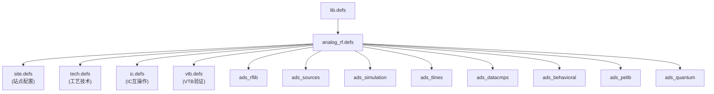

# ADS 库参考手册

> ADS 库定义体系和各库器件速查。不常用，需要时查阅。

---

## 一、ADS 库定义文件 (lib.defs / analog_rf.defs)

### 1.1 库定义体系

ADS 通过 `.defs` 文件管理库的注册与加载。项目 workspace 根目录的 `lib.defs` 是入口：

```plaintext
# python_wrk/lib.defs
INCLUDE $HPEESOF_DIR/oalibs/analog_rf.defs
DEFINE python_lib python_lib
ASSIGN python_lib libMode shared
```

- `INCLUDE` — 引入 ADS 自带的模拟/RF 库定义
- `DEFINE python_lib python_lib` — 注册用户自定义库
- `ASSIGN python_lib libMode shared` — 设置库为共享模式

### 1.2 analog_rf.defs 文件位置

```
$HPEESOF_DIR/oalibs/analog_rf.defs
→ D:\Program Files\Keysight\ADS2025_Update2\oalibs\analog_rf.defs
```

### 1.3 结构层次



### 1.4 完整库列表

| DEFINE 库名 | 库路径 | 用途说明 |
|------------|--------|---------|
| `ads_rflib` | `oalibs/rf/ads_rflib` | 模拟/RF 无源/有源器件（L、C、R、二极管、三极管等） |
| `ads_sources` | `oalibs/rf/ads_sources` | 信号源（V_1Tone、I_1Tone、VtSine、P_1Tone 等） |
| `ads_simulation` | `oalibs/rf/ads_simulation` | 仿真控制器、端口、测量方程 |
| `ads_tlines` | `oalibs/rf/ads_tlines` | 传输线模型（MLIN、MSUB、MSTEP、TLIN 等） |
| `ads_bondwires` | `oalibs/rf/ads_bondwires` | 键合线模型 |
| `ads_datacmps` | `oalibs/rf/ads_datacmps` | 数据组件（VAR、S2P、W_Element、Chain 等） |
| `ads_behavioral` | `oalibs/rf/ads_behavioral` | 行为级模型（运放、放大器、混频器、滤波器等） |
| `ads_textfonts` | `oalibs/rf/ads_textfonts` | 文本和字体 |
| `ads_common_cmps` | `oalibs/rf/ads_common_cmps` | 通用组件（子电路、测试台等） |
| `ads_designs` | `oalibs/rf/ads_designs` | 设计模板 |
| `ads_pelib` | `oalibs/rf/ads_pelib` | 射频功率元件（负载牵引、非线性模型等） |
| `ads_serdes_ref_channel` | `oalibs/rf/ads_serdes_ref_channel` | SerDes 参考通道 |
| `ads_quantum` | `oalibs/rf/ads_quantum` | 量子计算元件 |
| `Simulation_Sequencing` | `oalibs/rf/Simulation_Sequencing` | 仿真序列控制 |

---

## 二、各库器件速查

### 2.1 `ads_rflib` — 模拟/RF 无源有源器件

L / C / R / GROUND / Short / TF / Transformer / TransformerG / SLC / PLC / SRC / PRC / SRL / PRL / SRLC / PRLC / Diode / PIN / BIP / FET / MVSG / I_Probe / V_Probe / P_Probe / S_Probe / TimeDelta

### 2.2 `ads_tlines` — 传输线模型

MLIN / MSUB / MSTEP / MCROS / MCORN / MTEE / MTEEO / MBEND / MLANG / MLEF / MLOC / MLSC / MGAP / MRIND / MCFIL / MCLIN / MSVIA / MPVIA / MLVIA / TLIN / TLIND / CLIN / CPW / CPWG / SLIN / COAX / WR

### 2.3 `ads_simulation` — 仿真控制器与端口

S_Param / Term / TermG / MeasEqn / HB / LSSP / Tran / AC / DC / Envelope / ParamSweep / Optim / Goal / Yield / MonteCarlo / Sensitivity / Options / OscPort / OscTest / DisplayTemplate / Sequencer / SweepPlan / XDB / BUDGET

### 2.4 `ads_behavioral` — 行为级模型

Amplifier / Amplifier2 / OpAmp / OpAmpIdeal / Mixer / Mixer2 / Attenuator / LPF_Chebyshev / BPF_Chebyshev / HPF_Chebyshev / LPF_Butterworth / LPF_Bessel / LPF_Elliptic / Balun3Port / Balun4Port / Circulator / CouplerSingle / CouplerDual / Hybrid90 / Hybrid180 / PwrSplit2 / PwrSplit3 / Switch_V / VCO / TimeDelay / Limiter / Integrator / Differentiator / Comparator / VMult / VSum / IQ_Mod / IQ_Demod / Pad

> **BUF 器件**: ADS 无标准 BUF，可用 `ads_behavioral:OpAmpIdeal:symbol`（单位增益缓冲器）替代。

### 2.5 `ads_sources` — 信号源

V_1Tone / I_1Tone / P_1Tone / V_nTone / I_nTone / V_DC / I_DC / V_AC / I_AC / V_Noise / I_Noise / VtSine / VtPulse / VtStep / VtSquare / VtSFFM / VtPRBS / VtBitSeq

### 2.6 `ads_datacmps` — 数据与变量组件

VAR / S1P / S2P / S3P / S4P / SnP / Chain / DataAccessComponent / De_Embed / Deembed1~Deembed12 / NonlinC / NonlinL / W_Element / Hybrid / FDDnP / SDDnP

### 2.7 其他库

| 库名 | 说明 |
|------|------|
| `ads_bondwires` | 键合线模型 |
| `ads_pelib` | 射频功率元件（负载牵引、非线性模型等） |
| `ads_common_cmps` | 通用子电路（测试台、曲线追踪器等） |
| `ads_serdes_ref_channel` | SerDes 参考通道 |
| `ads_quantum` | 量子计算元件 |
| `ads_textfonts` | 文本字体 |
| `ads_designs` | 设计模板 |
| `Simulation_Sequencing` | 仿真序列控制 |

---

## 三、库路径命名规则

ADS Python API 中调用元件的格式为：

```
<库名>:<元件类型>:<视图>
```

| 部分 | 含义 | 示例 |
|------|------|------|
| `库名` | `DEFINE` 定义的库名，如 `ads_rflib` | `ads_rflib` |
| `元件类型` | 元件类型名，如 `L`、`C`、`MLIN` | `L` |
| `视图` | 固定为 `symbol`（原理图符号） | `symbol` |

```python
# 完全限定路径
design.add_instance("ads_rflib:L:symbol", (x, y))
# 某些元件需用元组形式
design.add_instance(("ads_datacmps", "VAR", "symbol"), (x, y))
```

**注意：** 元组路径 `("ads_simulation", "MeasEqn", "symbol")` 与字符串路径 `"ads_simulation:MeasEqn:symbol"` 等价，但 VAR 和 MeasEqn 必须用元组形式。
